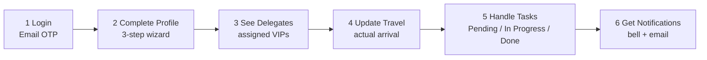

# Help & Support — Liaison Officer manual

Your quick guide to completing your LO profile, coordinating with your assigned delegates and tracking your tasks.

**Event:** Aero India 2027 · Made for LO Committee  
**Source:** Mirrors the live CAP Liaison Officer Help & Support content. If a menu item appears in the portal sidebar (or the equivalent mobile surface), its documentation is below.

**Download User Manual:** On web, the portal generates a PDF. On this Flutter app, **Help & Support → Download user manual** shares a markdown copy via the device share sheet (no backend PDF API).

Related: [API ↔ Help crosswalk](lo-help-api-and-requirements.md) · [CAP LO endpoints](api-lo-endpoints.md)

---

## Quick Overview

The whole LO Committee flow, in the order you'll use it. Each step links to the detailed section below.

1. You are nominated as a Liaison Officer by your Organisation Representative and receive an email with the LO portal link.
2. Sign in with Email OTP — no password is stored anywhere in the system.
3. Open **My Profile** and complete the three-step wizard (Personal Details, Document Uploads, Prior LO Experience), then **Submit**.
4. Once the LO Committee assigns delegates to you, they appear under **My Delegates** with their arrival, departure and event details.
5. When a delegate lands, record their actual arrival flight, terminal, date and time from the same page — the update is visible to the LO Committee.
6. Track work under **My Tasks**: each task is grouped by delegate and can be flipped between Pending, In Progress and Completed.
7. Email and in-portal notifications keep you posted on new task assignments, delegate updates and schedule changes.

---

## End-to-end workflow

How the LO Committee screens connect from configuration through operation and follow-up.

| Step | Title | Summary |
|------|-------|---------|
| 1 | Login | Email OTP |
| 2 | Complete Profile | 3-step wizard |
| 3 | See Delegates | assigned VIPs |
| 4 | Update Travel | actual arrival |
| 5 | Handle Tasks | Pending / In Progress / Done |
| 6 | Get Notifications | bell + email |

---

## Contents

1. [Access & Login](#1-access--login)
2. [Complete & Submit Your Profile](#2-complete--submit-your-profile)
3. [View Assigned Delegates and Event Details](#3-view-assigned-delegates-and-event-details)
4. [Update Delegate Travel Details](#4-update-delegate-travel-details)
5. [Manage Your Tasks](#5-manage-your-tasks)
6. [Notifications & Updates](#6-notifications--updates)
7. [Help & Support](#7-help--support)
8. [Appendix — Mobile app map](#appendix--mobile-app-map)

---

## 1. Access & Login

### Purpose

You are nominated as a Liaison Officer by your Organisation Representative. Once the nomination is saved, the system emails you the LO portal link at the nomination email. Sign in through Email OTP — no password is ever asked for or stored.

### Where to find it

Portal URL from the nomination email → Liaison Officer login.

**Mobile:** App launch → Login screen (email → CAPTCHA → OTP).

### Step-by-step

**Step 1 — Enter your email**

Use the email your Organisation Representative nominated you on. This email is your login identifier and cannot be changed from inside the portal.

**Step 2 — Verify OTP**

A one-time OTP is sent to that email. Enter it to complete sign-in and land on My Profile (web) or the Delegates tab (mobile).

### Note

- If you did not receive the portal link, check spam and then ask your Organisation Representative to re-send it — only they can re-trigger the invite.
- OTP is required on every sign-in. Sessions do not persist across logouts.
- **Mobile:** CAPTCHA is required before requesting OTP (same CAP auth APIs).

---

## 2. Complete & Submit Your Profile

### Purpose

Your first job as an LO is to complete your own record. **My Profile** opens in a read-only view; use the header CTA to enter a three-step wizard covering Personal Details, Document Uploads and Prior LO Experience. Nothing is written to the backend until you press **Submit** on the final step — the whole profile is saved in one atomic write (web UX; mobile orchestrates the same CAP calls on submit).

### Where to find it

Liaison Officer login → **My Profile** → Complete Profile / Update Details.

**Mobile:** Avatar menu → **My Profile**.

### Fields

| Field | Required | Description |
|-------|----------|-------------|
| First Name / Last Name | Required | Personal Details tab — your legal name. |
| Mobile Number (from Nomination) | Required | Personal Details tab — pre-filled from the nomination but editable here. |
| Aadhaar Number | Required | Personal Details tab — 12 digits (spaces allowed while typing). |
| Languages Known | Optional | Personal Details tab — chip list. Pick a language and click Add; multiple entries are allowed. |
| Photo & Specimen Signature | Required | Document Uploads tab — JPEG / JPG / PNG only. Both are mandatory. |
| Prior LO Experience rows | Optional | Prior LO Experience tab — after **Has LO Experience?** Yes/No. Columns: Event Name, Year, Role / Responsibilities, Delegate Details (optional). Add one row per past assignment via **+ Add Experience**. |

Additional Personal Details fields (wizard Step 1): Salutation, gender, date of birth, rank / designation, organisation ID number, personal email, personal contact, WhatsApp number. Organisation name/type and nomination email are typically read-only.

Document Uploads (wizard Step 2 — all six mandatory on web): Photo, Specimen Signature, Aadhaar (Front & Back), Organisation Badge (Front & Back). Slot badges show Not Uploaded, Ready to submit (picked but not saved) or Uploaded (persisted).

### Available actions

| Action | Description |
|--------|-------------|
| Complete Profile / Update Details | Header button on the view screen — enters the wizard. |
| Stepper (click to jump) | Jump between Personal Details, Document Uploads and Prior LO Experience without losing entered data. |
| Back / Next | Wizard navigation. Each step validates required fields before advancing. |
| Choose file / Replace / Clear | Per-document upload controls on the Document Uploads tab. Clear is only visible for pending (unsaved) files. |
| Submit | Only on the final step. Commits every change across all three steps in one write — this is the only moment data reaches the server. |

### Step-by-step

1. **Personal Details** — Salutation, gender, name, date of birth, rank / designation, organisation ID number, Aadhaar, personal email, personal contact, WhatsApp number and Languages Known. Mandatory fields are marked with an asterisk.
2. **Document Uploads** — Upload Photo, Specimen Signature, Aadhaar (Front & Back) and Organisation Badge (Front & Back). All six are mandatory and only JPEG / JPG / PNG images are accepted.
3. **Prior LO Experience** — Answer **Has LO Experience?** (Yes / No). If Yes, add rows with Event Name, Year, Role / Responsibilities and optional Delegate Details (**+ Add Experience**). Press **Submit** on this step to persist the entire profile.

### Note

- Nothing writes to the backend between steps — if you close the tab before Submit, everything you typed on the current session is lost.
- The email shown at the top is your nomination email. It is read-only and cannot be edited from inside the portal.
- On the **read-only My Profile** view, document slots can show **Load failed** / **Preview unavailable** even after a successful wizard upload. That is a CAP preview/fetch issue on the view screen, not a missing upload API — re-open **Update Details** or check the upload endpoints (`photo`, `signature`, `aadhaar-*`, `org-badge-*`).

---

## 3. View Assigned Delegates and Event Details

### Purpose

Once the LO Committee's Nodal Officer assigns delegates to you, they show up on **My Delegates**. Every VIP allocated to you appears in the table with their category, arrival and departure information. The page subtitle: *Use the action icons for family members, event nominations, vehicle allocations and to record actual arrival / departure details.*

### Where to find it

Liaison Officer login → **My Delegates**.

**Mobile:** Bottom nav → **Delegates** tab → tap a row for full detail.

### Available actions

| Action | Description |
|--------|-------------|
| View (eye icon) | Opens the Delegate Details dialog — Salutation, Full Name, Designation, Organisation, Country, Protocol / Category, Email, Mobile and the full Arrival Flight / Terminal / Date / Time. |
| Family members (people / group icon) | Opens family-member management for the row. **No** dedicated path under `/app/my-lo/me/**` in Swagger — web-only / outside My LO OpenAPI today. |
| Event nominations (calendar / person icon) | Opens event nominations for the assignment (`GET …/assignments/{assignmentId}/nominations`). |
| Vehicle allocations (car icon) | Opens vehicles allocated to the delegate (`GET …/assignments/{assignmentId}/vehicles`). |
| Update actual arrival (plane / arrival icon) | Opens the Update Actual Arrival dialog for the row. See [section 4](#4-update-delegate-travel-details) (`PUT …/arrival-flight`, `PUT …/travel`). |
| Search / Density / Columns | Search across columns; Density adjusts row height; Columns toggles visibility. Sort / paginate from the table footer. |

**Mobile:** Detail screen also surfaces itinerary (composed), transport/vehicles, and movement editors. The four web list icons map to detail cards or sheets on mobile (family remains a gap if CAP has no LO family API).

### Note

- The table columns are: Delegate (name + secondary id / designation), Type (Foreign / Domestic), Country / Category, Arrival, Departure and Actions.
- If a delegate does not appear here, they have not yet been assigned to you — the LO Committee decides allocations.

---

## 4. Update Delegate Travel Details

### Purpose

When your delegate lands, capture the real arrival flight details straight from the same row on **My Delegates**. The plane icon on any row opens a small dialog for Flight #, Terminal, Arrival Date and Arrival Time. Your update is saved immediately and is visible to authorised users of the LO Committee.

### Where to find it

Liaison Officer login → **My Delegates** → Actions column → Update actual arrival (plane icon).

**Mobile:** Delegates → open delegate → movement / arrival-flight editor.

### Fields

| Field | Required | Description |
|-------|----------|-------------|
| Flight # | Optional | Actual arrival flight number. |
| Terminal | Optional | Arrival terminal. |
| Arrival Date | Optional | Actual arrival date. |
| Arrival Time | Optional | Actual arrival time (HH:MM). |

### Available actions

| Action | Description |
|--------|-------------|
| Save | Persists the arrival details to the delegate's record. The delegate row updates immediately. |
| Cancel | Closes the dialog without saving any changes. |

### Note

Update these details as soon as the delegate lands — the arrival information becomes part of the delegate's audit trail and is visible to the LO Committee straight away.

**Mobile:** Additional movement kinds (arrival / transfer / venue entry / departure) may use `PUT …/travel` as well as `PUT …/arrival-flight`. Failed writes can queue offline and flush on next portal load.

---

## 5. Manage Your Tasks

### Purpose

**My Tasks** lists every task the LO Committee has assigned to you. Each row shows the task title and description, the linked delegate, the scheduled date and time, the location and a current status badge. Flip the status with the per-row **status action** (sync / update control in the Actions column — opens a status picker) as work progresses.

### Where to find it

Liaison Officer login → **My Tasks**.

**Mobile:** Bottom nav → **Tasks** tab.

### Fields

| Field | Required | Description |
|-------|----------|-------------|
| New Status | Required | Pick from Pending, In Progress or Completed. The change is saved as soon as you pick it. |

### Available actions

| Action | Description |
|--------|-------------|
| Per-row status action | Control in the Actions column (refresh/sync-style on web). Opens a status picker for Pending, In Progress or Completed — the update is immediate. |
| Mark In Progress | Pick In Progress when you actively start working on the task. |
| Mark Completed | Pick Completed once the task is done — the row's status badge turns green. |

### Note

- Stat cards at the top show live Pending, In Progress and Completed counts across all your tasks.
- Tasks are grouped by delegate in an expandable section (counts in the group header).
- Use the search box to jump to a task by title, description or the delegate's name — useful when several tasks belong to the same event.
- **Mobile:** Tasks are grouped by delegate; optional remarks on status change; offline queue syncs when online.

---

## 6. Notifications & Updates

### Purpose

You will not need to keep refreshing pages — the portal notifies you when something relevant changes. Notifications reach you through the in-portal bell in the top bar and through email on the nomination address.

### Where to find it

Liaison Officer login → notification bell (top bar), and your nomination-email inbox.

**Mobile:** AppBar bell → CAP inbox; **Alerts** tab for local notices / reminders.

### Available actions

| Action | Description |
|--------|-------------|
| Notification bell | Opens the in-portal notification centre with the most recent updates. |
| Email inbox | The same events are also emailed to your nomination address so you get them even when signed out. |

### Note

You receive notifications for: new task assignments, task updates or reassignment, delegate detail changes, delegate travel / accommodation / event changes, and upcoming scheduled tasks.

In-portal notifications and emails cover the same events — one is the record, the other is the reminder.

**Mobile:** Optional FCM push (`ENABLE_FCM`) is a follow-up; local OS reminders cover task lead times.

---

## 7. Help & Support

### Purpose

This page — a quick reference for the Liaison Officer portal.

### Where to find it

Liaison Officer login → **Help & Support**.

**Mobile:** Avatar menu → **Help & Support**.

### Available actions

| Action | Description |
|--------|-------------|
| Download User Manual | Generates and downloads a PDF (web) or shares a markdown copy (mobile) for offline reference. |

---

## Appendix — Mobile app map

| Help section | Web path | Mobile surface |
|--------------|----------|----------------|
| 1. Access & Login | Nomination email → LO login | Login screen (email + CAPTCHA + OTP) |
| 2. Profile | My Profile → Update Details | Avatar → My Profile (3-step wizard) |
| 3. Delegates | My Delegates | Delegates tab → detail |
| 4. Travel | My Delegates → plane icon | Delegate detail → arrival / movement sheets |
| 5. Tasks | My Tasks | Tasks tab |
| 6. Notifications | Top-bar bell + email | AppBar bell (CAP inbox) + Alerts tab |
| 7. Help | Help & Support | Avatar → Help & Support |

**Mobile extras (not in web Help sections 1–7):** Issue reporting (detail / Alerts), Theme toggle, offline queues for task status and travel writes. See [lo-help-api-and-requirements.md](lo-help-api-and-requirements.md).

---

Made for LO Committee — Aero India 2027. Content mirrors the live application.
