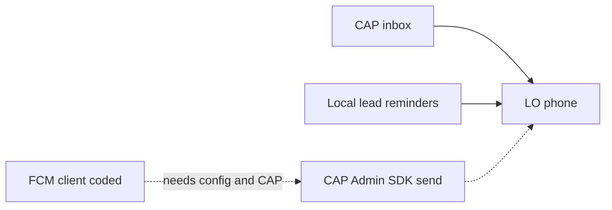

# Notifications — what is implemented and what is still needed

Status of notification behaviour in the Liaison Officer Flutter app (`feature/lo-mobile-production`).

This page is the source of truth for requirement **#11 / LO.9.4**. The in-app Help screen still describes FCM as a follow-up; that sentence is older than this page.

Related:

- API paths: [`api-lo-endpoints.md`](api-lo-endpoints.md)
- Requirement row: [`lo-requirements-matrix.md`](lo-requirements-matrix.md)
- Store, permissions, and the longer architecture notes: [`store-launch-and-notifications-guide.md`](store-launch-and-notifications-guide.md)



## Summary

| Channel | Works today without Firebase | Needs CAP or Firebase before it delivers |
|---------|------------------------------|------------------------------------------|
| CAP in-app inbox (bell) | Yes, against live CAP | — |
| Alerts tab (local list) | Yes, on device | — |
| OS lead-time reminders | Yes, from task data on the phone | — |
| Remote push (FCM) | Client code is in the app and **off** | `google-services.json`, `ENABLE_FCM=true`, and CAP sending via the Firebase Admin SDK |

---

## Implemented

### 1. CAP inbox

The signed-in Liaison Officer can read the portal notification feed.

| Piece | Where |
|-------|--------|
| Repository | [`DioNotificationsRepository`](../lib/features/liaison_officer/data/repository/dio_notifications_repository.dart) (mock twin when `USE_MOCK_API=true`) |
| Screen | AppBar bell → [`NotificationsInboxScreen`](../lib/features/liaison_officer/presentation/screens/notifications_inbox_screen.dart) |
| Contract | [`NotificationsRepository`](../lib/features/liaison_officer/domain/notifications_repository.dart) |

Swagger-confirmed paths (Bearer JWT):

| Method | Path | Behaviour |
|--------|------|-----------|
| GET | `/app/notifications/mine` | Latest items (CAP returns up to about 50) |
| POST | `/app/notifications/mine/{id}/read` | Mark one read |
| POST | `/app/notifications/mine/read-all` | Mark all read |
| GET | `/app/notifications/mine/unread-count` | Badge count |

Item fields used by the app: `id`, `title`, `message`, `kind`, `link`, `isRead`, `createdAt`, `readAt`.

The unread badge is loaded when the shell opens and again when the user leaves the inbox. It does not poll or use a websocket.

A `link` that contains `task` switches to the Tasks tab. A `link` that contains `delegate` switches to the Delegates tab. The same rule is used for an FCM tap.

### 2. Alerts tab (on-device list)

Bottom nav **Alerts** is [`LoNotificationsScreen`](../lib/features/liaison_officer/presentation/screens/lo/lo_notifications_screen.dart).

It shows operational notices written on the phone while the officer uses the portal: task status changes, travel and movement updates, profile submit, uploads, and issue submit or queue. Those rows live in the local portal cache. They are not the CAP inbox.

The same screen has:

- Lead-time picker: **15, 30, 60, or 120 minutes** (default 60), stored in SharedPreferences as `lo_alert_lead_minutes`
- A shortcut into the CAP inbox
- A shortcut to issue reports, including how many issues are still unsynced

### 3. Local OS reminders

[`PushNotificationService.scheduleTaskLeadReminders`](../lib/core/services/push_notification_service.dart) runs after the portal loads tasks and again when the lead time changes.

- Package: `flutter_local_notifications`
- Time zone: `Asia/Kolkata` (falls back to UTC if that zone data is missing)
- Channel: `lo_task_reminders` (“Task reminders”)
- Who is scheduled: tasks that are not completed or cancelled and that have a date
- When: `scheduledDate` + `scheduledTime`, minus the lead minutes. If that moment has already passed but the task itself is still in the future, the reminder is shown immediately
- Tap payload: `task:<id>`, which opens the Tasks tab once the shell is up

These reminders are rebuilt from task data on the device. They do not call Firebase and they do not need CAP to push.

Android manifest already declares `POST_NOTIFICATIONS`, `RECEIVE_BOOT_COMPLETED`, `VIBRATE`, and `SCHEDULE_EXACT_ALARM`, plus the scheduled-notification receivers. Scheduling uses inexact-while-idle mode, so the alarm permission is declared but reminders are not exact alarms.

### 4. FCM client (coded, off by default)

Remote push code is in the app. It does not run unless the build opts in and a real Firebase Android config was present at build time.

| Piece | Where |
|-------|--------|
| Init, foreground display, tap | [`PushNotificationService`](../lib/core/services/push_notification_service.dart) |
| Token POST | [`FcmDeviceRegistrar`](../lib/core/services/fcm_device_registrar.dart) |
| Called from | App start after session restore, and again from `navigateToRoleHome` after OTP login |
| Logout | Drops the in-memory token only. CAP is not told to delete it |

When `ENABLE_FCM=true` and `Firebase.initializeApp()` succeeds:

1. The app requests notification permission and reads the FCM registration token.
2. It `POST`s `/api/devices/register` with `{ "email", "fcmToken", "platform" }` where `platform` is `android` or `ios`.
3. It repeats that POST on token refresh while a valid session exists.
4. A foreground message is shown on channel `lo_push` (“CAP alerts”). Title and body come from the notification block, or from data keys `title` and `body`.
5. A tap uses data key `link`. `task` → Tasks tab. `delegate` → Delegates tab.
6. If CAP returns 404 or any other error, the failure is logged. The inbox and local reminders keep working.

`ENABLE_FCM` defaults to **false** (`bool.fromEnvironment`). The Google Services Gradle plugin in [`android/app/build.gradle.kts`](../android/app/build.gradle.kts) is applied only when `android/app/google-services.json` exists, so a release build without that file still succeeds.

There is no `google-services.json` in this repository. Do not commit a fake one.

---

## Still needed

Remote push does not reach a locked phone until the items below exist. The Flutter client cannot send pushes by itself.

### Firebase project (mobile config)

1. Create a Firebase project and add an Android app with application id `com.bel.liaison_officer`.
2. Place the real `google-services.json` in `android/app/`.
3. Build and run with `--dart-define=ENABLE_FCM=true` (together with the usual live CAP defines).

```bash
flutter run --release `
  --dart-define=USE_MOCK_API=false `
  --dart-define=API_BASE_URL=http://35.244.48.209:8080 `
  --dart-define=ENABLE_FCM=true
```

Without the JSON file, `Firebase.initializeApp()` fails and the service stays off. Without `ENABLE_FCM=true`, the service never calls Firebase.

### CAP must store the token

`POST /api/devices/register` is **not** in the live Swagger (`/v3/api-docs`). The app already calls it and ignores 404.

CAP needs to accept:

```json
{ "email": "lo@example.com", "fcmToken": "<device token>", "platform": "android" }
```

Store the token against that Liaison Officer. Replace the previous token for the same device when FCM rotates it (the app POSTs again on refresh).

### CAP must send the push

When a task is assigned or updated, a schedule changes, or a B2B meeting is requested for that officer’s delegates, CAP looks up the stored token and sends with the **Firebase Admin SDK** (FCM HTTP v1).

Suggested data payload (keep the whole message under 4 KB):

| Key | Example |
|-----|---------|
| `title` | `Task assigned` |
| `body` | `Airport pickup · Delegate name` |
| `link` | `task:<taskId>` or `delegate:<assignmentId>` |

The Admin SDK private key stays on the CAP server. It must not be placed in the Flutter app, in git, or in the APK.

FCM delivery itself has no per-message fee on the Spark plan. This app does not use Cloud Firestore or Cloud Functions to trigger pushes. CAP already holds the tasks and the in-app feed, so CAP is the sender.

### iOS

This tree is Android-first. There is no `GoogleService-Info.plist`, no Push Notifications capability, and no Remote notifications background mode. Those are required before an iPhone can receive the same pushes. FCM on iOS also needs an APNs key uploaded to the Firebase project.

### Badge freshness

The AppBar unread count refreshes when the shell starts and when the user returns from the inbox. It does not update while the officer stays on Delegates or Tasks. A later change can poll `unread-count` or refresh it when a push arrives.

### Help copy

[`help_support_screen.dart`](../lib/features/liaison_officer/presentation/screens/help_support_screen.dart) still says optional FCM is a follow-up and that local reminders cover lead times. That is still true for builds that do not set `ENABLE_FCM`. This document is the accurate split between shipped inbox and reminders, and remote push that is waiting on Firebase plus CAP.
